# International Cybersecurity and Digital Forensics Academy (ICDFA)

## SBT-DF203: Basic Networking Skills for Digital Forensics

### LAB 7: DNS Introduction and Traffic Analysis

<table>
<thead><tr>
<th>Course Code</th>
<th>SBT-DF203</th>
</tr></thead>
<tbody>
<tr>
<td>Registration Number</td>
<td>FWSD25/11242</td>
</tr>
<tr>
<td>Course Title</td>
<td>Basic Networking Skills for Digital Forensics</td>
</tr>
<tr>
<td>Lab Number</td>
<td>Lab 7</td>
</tr>
<tr>
<td>Lab Title</td>
<td>DNS Introduction and Traffic Analysis</td>
</tr>
<tr>
<td>Required Evidence</td>
<td>dig_dns.pcap or locally generated DNS captures; optional smtp.pcap correlation</td>
</tr>
</tbody>
</table>

<i> 22/09/2026 </i>

# Learning Outcomes

Explain recursive and iterative DNS resolution at a foundational level.

Use dig to query A, AAAA, MX and NS records.

Capture and analyze DNS queries and responses with tshark/Wireshark.

Identify transaction ID, query name, record type, response code, answer and TTL.

Correlate DNS responses with later IP connections.

Recognize normal variations such as multiple answers, CNAMEs, cache responses and IPv6 queries.

# Executive Summary

This lab introduced Domain Name System (DNS) concepts and practical DNS traffic analysis using dig and tshark on a Kali Linux workstation. DNS A, AAAA, MX and NS records for example.com were queried, and the outputs showed successful NOERROR responses through the local resolver at 127.0.0.53. A fresh DNS capture was then analyzed at packet level. The query used transaction ID 0x672a and was sent from 192.168.37.221:60319 to the resolver at 192.168.37.2:53. The response returned two IPv4 addresses, 104.20.23.154 and 172.66.147.243, with a TTL of 5 seconds and an observed query-response delay of approximately 0.169 seconds. Browser-generated DNS traffic also demonstrated multiple A and AAAA lookups for the visited page and supporting services. The later TCP-destination extraction produced no displayed entries, so a direct DNS-to-TCP correlation could not be confirmed from that capture. An optional SMTP capture was also examined and showed an A lookup for mail.patriots.in resolving to 74.53.140.153. Overall, the exercise demonstrated how DNS records and packet fields can be extracted, interpreted, documented and correlated as digital forensics evidence.

# Lab Folder Structure and Evidence Preparation

```bash
Command used: mkdir -p ~/SBT-DF203-Lab7/{evidence,working,exported,reports,screenshots,scripts}
```
Command description: Creates the lab directory structure and separates evidence, working files, reports, screenshots and scripts

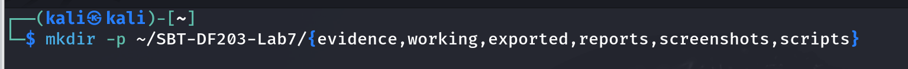
```bash
Command used: cd ~/SBT-DF203-Lab7
```
Command description: Changes the current directory to the Lab 7 working directory.


```bash
Command used: pwd
```

Command description: Displays the current working directory so the analyst can verify the location.


```bash
Command used: find . -maxdepth 1 -type d -print
```

Command description: Lists the first-level directories in the lab folder to confirm that the required structure exists.

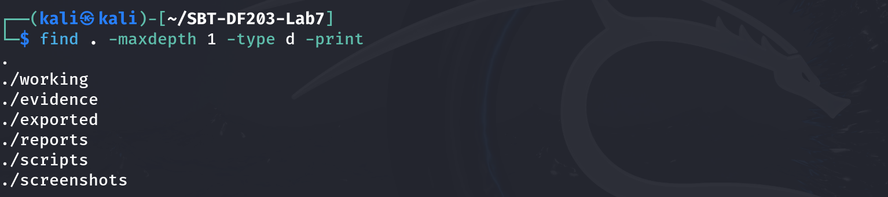

Create the folder structure before downloading or generating evidence. Store original captures under evidence and analysis copies under working.

```bash
sudo apt updateCommand used: sudo apt install -y dnsutils tshark wireshark
```

Command description: Updates the APT package index and installs DNS utilities, tshark and Wireshark for DNS querying and packet analysis.

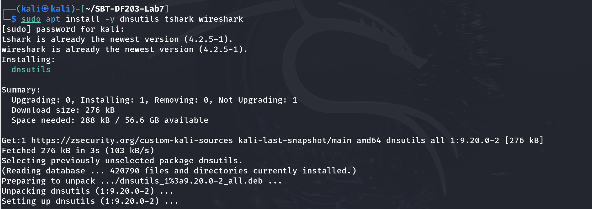
```bash
Command used: cat /etc/resolv.conf | tee reports/resolv_conf.txt
```

Command description: Displays the system resolver configuration and saves a copy to the reports directory for documentation.

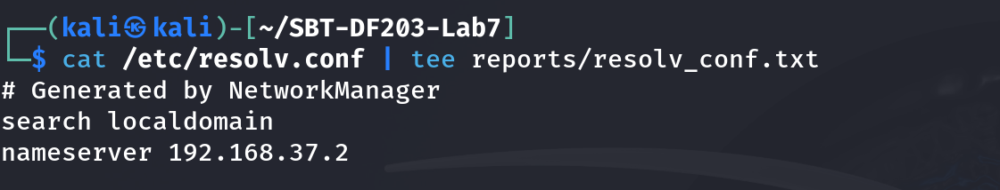
```bash
Command used: resolvectl status 2>/dev/null | tee reports/resolvectl_status.txt || true
```

Command description: Displays resolver status, including configured DNS information; the final '|| true' prevents a non-zero result from stopping the command sequence.


```bash
Command used: wget -O evidence/dig_dns.pcap \  'https://raw.githubusercontent.com/frankwxu/digital-forensics-lab/main/Networking_Forensics/lab_files/dns/dig_dns.pcap'
```

Command description: Downloads the supplied DNS packet capture into the evidence directory

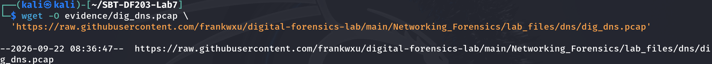
```bash
Command used: cp --preserve=timestamps evidence/dig_dns.pcap working/dig_dns_working.pcap
```

Command description: Creates a working copy of the original capture while preserving its timestamps.


```bash
Command used: sha256sum evidence/dig_dns.pcap working/dig_dns_working.pcap | tee reports/dns_capture_hashes.txt
```

Command description: Calculates SHA-256 hashes for the original and working captures and records them for evidence integrity verification.

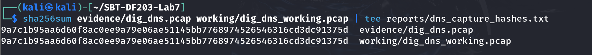

Screenshot required: Configured resolver information, evidence details and hashes.

# Mini Evidence and Chain-of-Custody Worksheet

<table>
<thead><tr>
<th>Field</th>
<th>Student Entry</th>
</tr></thead>
<tbody>
<tr>
<td>Case/lab identifier</td>
<td>SBT-DF203-Lab7-Basiru-Aliyu</td>
</tr>
<tr>
<td>Trainee name</td>
<td>Basiru Aliyu</td>
</tr>
<tr>
<td>Date and time started</td>
<td>22 September 2026 (exact start time not captured in the worksheet screenshots)</td>
</tr>
<tr>
<td>Evidence file name(s)</td>
<td>dig_dns.pcap; fresh_dig_dns.pcapng; browser_dns.pcapng; optional smtp_working.pcap</td>
</tr>
<tr>
<td>Source or generation method</td>
<td>dig_dns.pcap was downloaded from the supplied GitHub lab source; fresh_dig_dns.pcapng and browser_dns.pcapng were generated locally with tshark.</td>
</tr>
<tr>
<td>Original SHA-256</td>
<td>9a7c1b95aa6d60f8ac0ee9a79e06ae51145bb7768974526546316cd3dc91375d</td>
</tr>
<tr>
<td>Working-copy SHA-256</td>
<td>9a7c1b95aa6d60f8ac0ee9a79e06ae51145bb7768974526546316cd3dc91375d</td>
</tr>
<tr>
<td>Analysis workstation/VM</td>
<td>Kali Linux workstation/VM (interface eth0)</td>
</tr>
<tr>
<td>Notes on any changes</td>
<td>The original capture was copied to the working directory with timestamps preserved. The original and working-copy SHA-256 hashes match.</td>
</tr>
</tbody>
</table>

# Part A - Query DNS Records with dig

```bash
Command used: dig example.com A | tee reports/dig_example_A.txt
```

Command description: Queries the A (IPv4 address) records for example.com and saves the dig output to a report file.

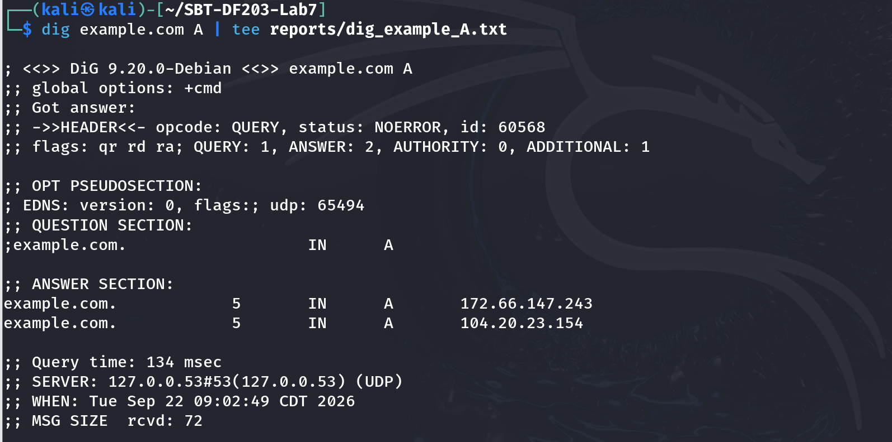
```bash
Command used: dig example.com AAAA | tee reports/dig_example_AAAA.txt
```

Command description: Queries the AAAA (IPv6 address) records for example.com and saves the output.

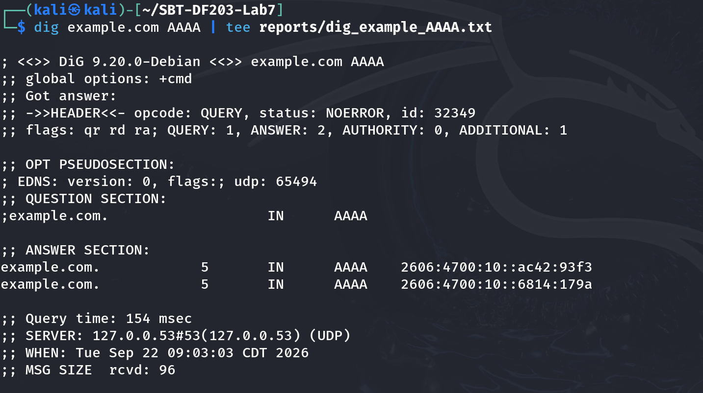
```bash
Command used: dig example.com MX | tee reports/dig_example_MX.txt
```

Command description: Queries the MX (mail exchange) records for example.com and saves the output.

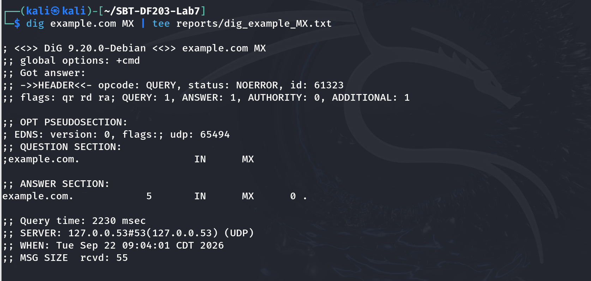
```bash
Command used: dig example.com NS | tee reports/dig_example_NS.txt
```

Command description: Queries the NS (name server) records for example.com and saves the output.

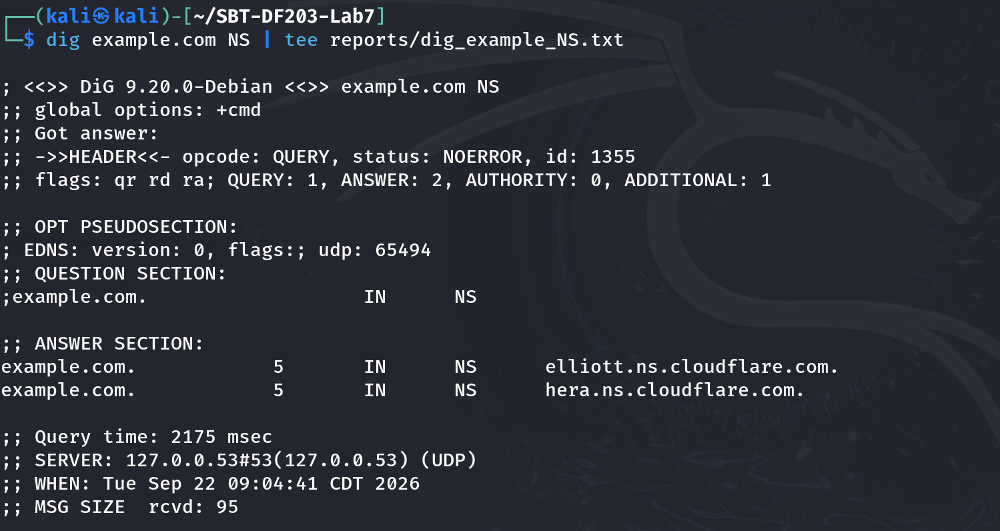
```bash
Command used: dig +short example.com A | tee reports/dig_example_short.txt
```

Command description: Requests only the IPv4 addresses from the A query, producing a short, easy-to-read result.

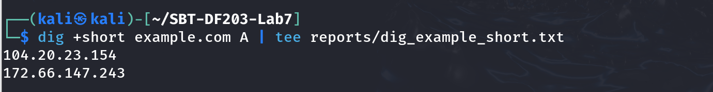

# Part B - Capture a Fresh DNS Query
```bash
Command used: IFACE=eth0sudo tshark -i "$IFACE" -f 'port 53' -a duration:25 -w evidence/fresh_dig_dns.pcapng &sleep 3dig +noedns example.com A >/dev/nullwait
```

Command description: Captures DNS traffic on eth0 for 25 seconds, then generates an example.com A query without EDNS so the query and response are recorded in a fresh pcapng file.

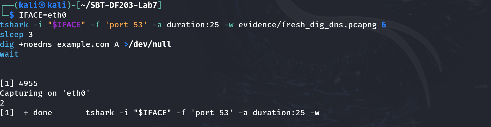
```bash
Command used: sha256sum evidence/fresh_dig_dns.pcapng | tee reports/fresh_dns_sha256.txt
```

Command description: Calculates and records the SHA-256 hash of the freshly generated DNS capture.

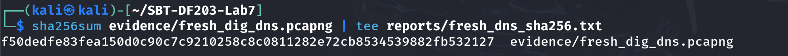

# Part C - Extract DNS Query and Response Fields
```bash
Command used: PCAP=evidence/fresh_dig_dns.pcapng
```

Command description: Stores the path of the fresh DNS capture in the PCAP shell variable for reuse in later tshark commands.


# Query
```bash
Command used: tshark -r "$PCAP" -Y 'dns.flags.response==0' -T fields \  -e frame.number -e frame.time -e ip.src -e udp.srcport -e ip.dst -e udp.dstport \  -e dns.id -e dns.qry.name -e dns.qry.type \  | tee reports/dns_queries.tsv
```

Command description: Extracts DNS query packets and selected fields such as frame number, timestamps, endpoints, transaction ID, query name and query type.
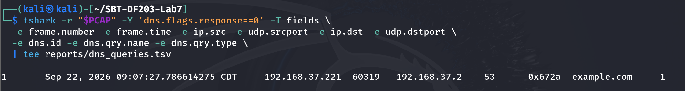
# Response
```bash
Command used: tshark -r "$PCAP" -Y 'dns.flags.response==1' -T fields \  -e frame.number -e frame.time -e ip.src -e udp.srcport -e ip.dst -e udp.dstport \  -e dns.id -e dns.flags.rcode -e dns.count.answers -e dns.a -e dns.aaaa -e dns.resp.ttl \  | tee reports/dns_responses.tsv
```

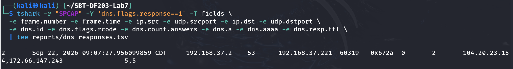

# Part D - Match Queries to Responses

<table>
<thead><tr>
<th>Transaction ID</th>
<th>Query Name</th>
<th>Type</th>
<th>Client/Resolver</th>
<th>Response Code</th>
<th>Answer(s)</th>
<th>TTL</th>
<th>Time Delta</th>
</tr></thead>
<tbody>
<tr>
<td>0x672a</td>
<td>example.com</td>
<td>A</td>
<td>192.168.37.221:60319 → 192.168.37.2:53</td>
<td>NOERROR (0)</td>
<td>104.20.23.154; 172.66.147.243</td>
<td>5 s</td>
<td>0.169486 s</td>
</tr>
</tbody>
</table>


# Part E - Analyze DNS Generated by a Browser

A browser may request several domains for the page, images, fonts, telemetry or cached services. Capture a visit to a non-sensitive instructor-approved site and inventory all query names.

```bash
Command used: sudo tshark -i IFACE -f 'port 53' -a duration:40 -w evidence/browser_dns.pcapng &sleep 3
```

Command description: Captures DNS traffic on eth0 for 40 seconds while the approved site is visited, saving the browser-generated DNS traffic.

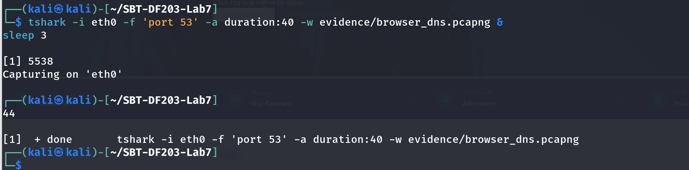
# Open the approved site in a private browser window, then wait.wait
```bash
Command used: tshark -r evidence/browser_dns.pcapng -Y 'dns.flags.response==0' -T fields -e dns.qry.name -e dns.qry.type \  | sort | uniq -c | sort -nr | tee reports/browser_dns_inventory.txt
```

Command description: Stops the capture after the browser activity and inventories DNS query names and record types, counting repeated requests.

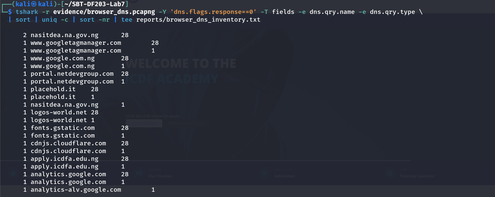

Part F - Correlate DNS with Subsequent Connections

# Extract DNS A answers

```bash
Command used: tshark -r evidence/browser_dns.pcapng -Y 'dns.a' -T fields -e frame.time_epoch -e dns.qry.name -e dns.a \  | tee reports/dns_A_answers.tsv
```

Command description: Extracts A-record answers from the browser DNS capture, including the time, queried name and returned IPv4 address.
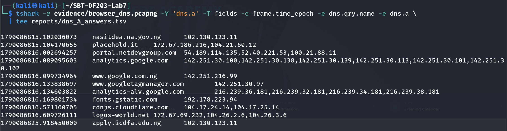
# Extract later TCP destinations
```bash
Command used: tshark -r evidence/browser_dns.pcapng -Y 'tcp.flags.syn==1 && tcp.flags.ack==0' -T fields \  -e frame.time_epoch -e ip.dst -e tcp.dstport \  | tee reports/subsequent_tcp_destinations.tsv
```

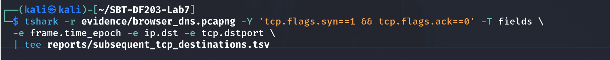

Select one DNS answer and show whether the client later initiates a connection to that IP. Explain any mismatch caused by multiple answers, proxies, CDNs, IPv6, caching or capture duration.

# Part G - DNS Analysis Within SMTP Evidence

If smtp.pcap from Lab 4 is available, filter dns and identify the query used to locate a mail server. Record the queried name, record type, resolver, answer and TTL.

# Optional, adjust path to your Lab 4 capture
```bash
Command used: tshark -r ../SBT-DF203-Lab4/working/smtp_working.pcap -Y 'dns' -T fields \  -e frame.number -e frame.time -e dns.qry.name -e dns.qry.type -e dns.a -e dns.resp.name -e dns.resp.ttl \  | tee reports/smtp_dns_correlation.tsv
```

Command description: Filters the optional SMTP capture for DNS traffic and extracts the fields needed to document the mail-server lookup.

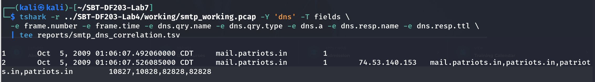

# Required Findings Worksheet

<table>
<thead><tr>
<th>Field</th>
<th>Finding</th>
</tr></thead>
<tbody>
<tr>
<td>Configured resolver IP</td>
<td>192.168.37.2</td>
</tr>
<tr>
<td>Client source port</td>
<td>60319</td>
</tr>
<tr>
<td>Resolver destination port</td>
<td>53/UDP</td>
</tr>
<tr>
<td>Transaction ID</td>
<td>0x672a</td>
</tr>
<tr>
<td>Query name and type</td>
<td>example.com — A</td>
</tr>
<tr>
<td>Response code</td>
<td>NOERROR (0)</td>
</tr>
<tr>
<td>Answer IP(s)</td>
<td>104.20.23.154; 172.66.147.243</td>
</tr>
<tr>
<td>TTL</td>
<td>5 seconds</td>
</tr>
<tr>
<td>Query-response time delta</td>
<td>Approximately 0.169486 seconds</td>
</tr>
<tr>
<td>Subsequent connection correlation</td>
<td>The browser DNS capture contained A-record answers, but the subsequent TCP SYN extraction displayed no destinations. Therefore, a direct DNS-to-TCP IP correlation could not be established from the shown evidence.</td>
</tr>
<tr>
<td>Normal variations observed</td>
<td>Multiple A answers; both A (IPv4) and AAAA (IPv6) queries; repeated A/AAAA lookups; several third-party domains such as Google Analytics, Google Tag Manager, gstatic and Cloudflare.</td>
</tr>
</tbody>
</table>

# Conclusion

The DNS lab successfully demonstrated how DNS records can be queried with dig and how DNS traffic can be captured and examined with tshark. The packet analysis identified the client and resolver addresses, UDP port 53, transaction ID, query name and type, response code, returned IP addresses, TTL and response time. The browser capture also showed that a single web visit can generate DNS requests for several first-party and third-party services and can include both IPv4 and IPv6 lookups. The optional SMTP analysis further demonstrated how DNS can be used to locate a mail server. Although the displayed browser capture did not provide a TCP SYN entry for a direct DNS-to-connection correlation, the exercise showed the evidence fields and workflow needed for such analysis. Overall, the lab strengthened practical understanding of DNS resolution, packet inspection, evidence integrity and basic network-forensics analysis.
